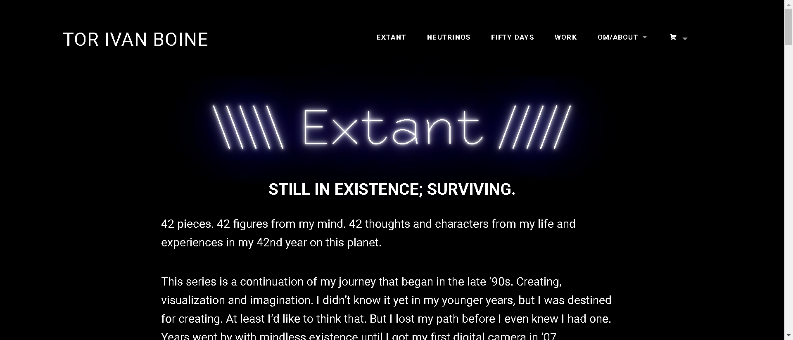

# Extant by Boine

你好！我是 Tor Ivan Boine，这些是我的 Extants。 

42 件。我脑海中的42个数字。我在这个星球上第 42 年的生活和经历中的 42 个想法和人物。

这个系列是我从 90 年代后期开始的旅程的延续。创造、可视化和想象力。我年轻的时候还不知道，但我注定要创造。至少我愿意这么想。但在我知道自己有一条路之前，我就迷路了。在 07 年我得到了我的第一台数码相机之前，无意识地生活了好几年。 

从那以后，我一直在拍照，只是按下快门的喜悦，瞬间定格，很神奇。直到去年我打开 Blender 并开始学习它，我才觉得我找到了自己的路。 

我不知道我有路。但现在我找到了。 

现存是我、我的思想、记忆和未来的一个形状。

