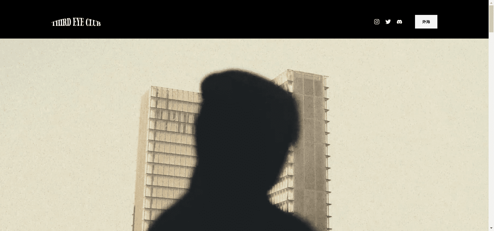

# Third Eye Club: Official

Third Eye Club Official，是一个 NFT（Non-fungible token）集合。存储在区块链上的数字艺术品集合。

2000 种生活在区块链上的独特生物
3033年，地球上的资源变得稀缺，导致科学家们创造了一种新的寄生虫。这种通过融合人类DNA制成的微生物，具有使宿主变得更强壮，能够在危及生命的环境中生存的能力。然而，寄生虫迅速变异，传播到其他物种，增殖，结果证明是一种无法控制的标本。

