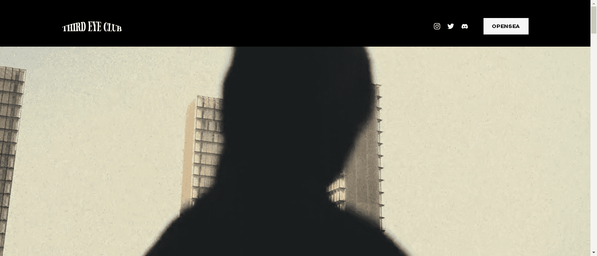

# Third Eye Club: Official

Third Eye Club Official，是一个 NFT（Non-fungible token）集合。存储在区块链上的数字艺术品集合。

总共有 10 个 Third Eye Club Official，NFT。目前有 2 位车主的钱包中至少有一位 Third Eye Club Official，NTF。

我们计划围绕天目宇宙创建一个完整的生态系统，同时不断为项目增加价值。每个 NFT 都可以让您访问各种实物产品，例如高级艺术书和独家服装系列。您还可以访问创作者俱乐部，在这里您可以与各种创作者和艺术家互动，访问免费研讨会、现实生活中的活动、艺术家基金（社区管理）以及更多福利。

