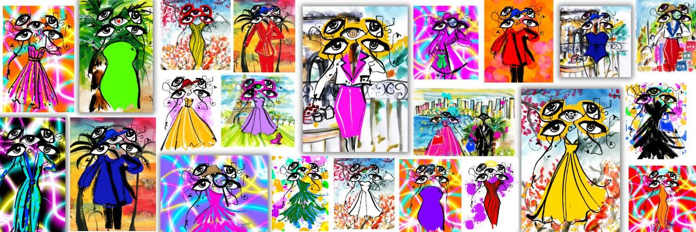

# Eyes of Fashion Charitable Pieces

Eyes of Fashion Charitable Pieces 是由Talia Zoref创建的精美艺术 NFT 集合，致力于慈善事业和捐赠。这个系列是建立在艺术可以真正成为世界美好的催化剂的信念之上的。这些销售的所有收益将捐赠给人道主义救济。100% 的主要和次要慈善机构。

Eyes of Fashion是由艺术家 Talia Zoref 创作的 8,888 幅独特时尚插画的集合，其灵感来自多彩有趣的时尚世界与行业评判眼之间的对比。该系列的公开发售在两分钟内售罄。我们的使命是为时尚界带来更多包容性，提升并赋予强大的女性艺术家权力，并通过教育赋予女性权力。

