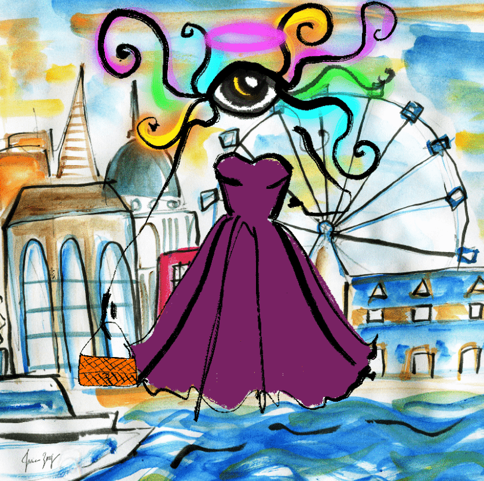

# Eyes of Fashion Official

Eyes of Fashion 是由 Talia Zoref 创作的 8,888 幅具有 250 多种手绘活力特征的美术 NFT 的集合，他的灵感来自色彩缤纷、有趣的时尚世界与贬低该行业的评判眼之间的对比。 我们的社区以艺术、时尚和通过教育赋予女性权力为中心。 用你的眼睛来展示你的风格！

[Eyes of Fashion]是由艺术家 Talia Zoref 创作的 8,888 幅独特时尚插画的集合，其灵感来自多彩有趣的时尚世界与行业评判眼之间的对比。该系列的公开发售在两分钟内售罄。我们的使命是为时尚界带来更多包容性，提升并赋予强大的女性艺术家权力，并通过教育赋予女性权力。

拥有我们的艺术家和联合创始人 Talia Zoref 的原创 NFT 艺术作品。

美术实体和数字时尚 

Eyes of Fashion 的使命是弥合物理世界和数字世界之间的鸿沟，让 web3 爱好者展示他们独特的风格。

通过教育增强妇女权能

为了提升女性，我们必须分享可用的知识和机会。获取这些信息是为女性创造更公平空间的关键。在科技、艺术和时尚行业支持和赋予女性权力。

