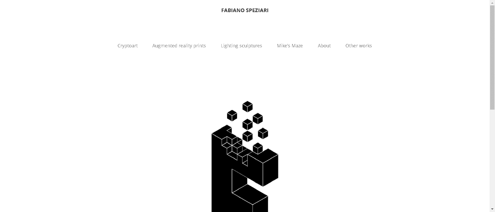

# Fabiano Speziari

欢迎来到 OpenSea 上 Fabiano Speziari 的家。发现这个系列中最好的项目。

Fabiano Speziari 出生于 1977 年。设计专业毕业后，他开始从事工业技术设计师和艺术家的工作，尝试不同的材料和技术，有一个指导理念：研究人类的灵魂、它与自然和环境的关系包围它。人们自然会被引导就周围的事物提出问题，但往往不知道如何回应，最终发现自己的问题多于答案。

多年来，从这些想法中产生了各种作品。最初，它们是在画布上完成的树木和自然形态，或者是由树脂制成的小型奇异动物。随后，他投入了数年时间，将艺术和装置置于大自然中，然后继续使用光线和明确的几何形式。他开始创作“铅笔中的信息”系列，用明亮的大铅笔传达信息。与此同时，他提出了聚集体的概念，即代表家庭和人类生活的住宅模块，它们被归入城市和标准化环境，赋予绘画和发光雕塑以生命。

