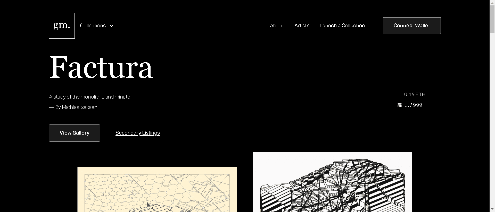

# Factura by Mathias Isaksen

通用汽车 工作室展示了 Mathias Isaksen 的“Factura”，这是一个探索整体和微小的生成系列。

该系列是生成艺术平台 gm 上的第四个系列。工作室

它由 999 件组成，于 2022 年 7 月 16 日推出。

“Factura”的发展可以被描述为一种平衡对立品质的行为：单一和微小。结构与无序。复杂而朴素。微妙而明确。这是一项艰巨的任务，许多相互关联的部分以不可预测的方式相互作用。

