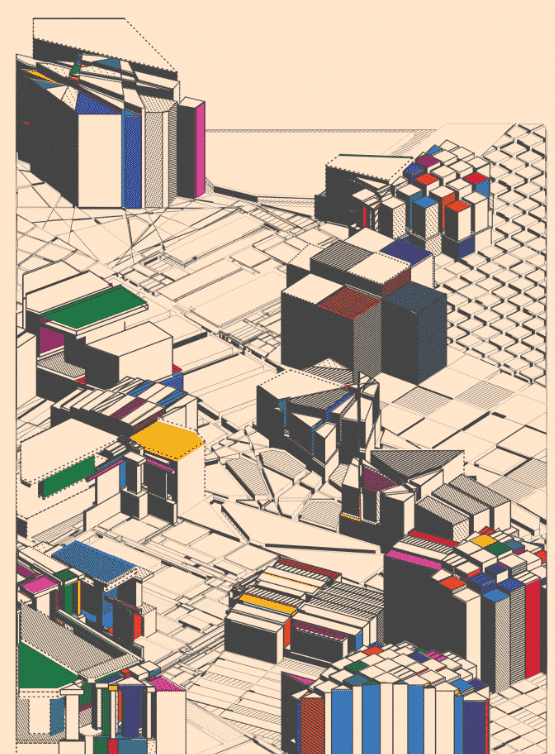

# Factura by Mathias Isaksen

通用汽车 工作室展示了 Mathias Isaksen 的“Factura”，这是一个探索整体和微小的生成系列。该系列是生成艺术平台 gm 上的第四个系列。 工作室它由 两年前，也就是 2020 年 7 月，我开始了我的生成艺术和创意编码之旅。我最早的一些作品探索了沿着一条线切割形状的过程，产生两个或更多更小的形状。虽然这是一个非常简单（且非原创）的想法，但它所产生的复杂而错综复杂的行为以及可以扩展的方式数量让我非常着迷。这在“挖到结构直到倒塌”中得到了证明，这是一件 2020 年的作品，将圆形递归地切割成更小的形状。它以一个大而普通的圆圈开始，以一个小圆圈结束，经过多次切割，线条融入了实心填充。尽管只使用直线和平面填充，但这个过程会产生意想不到的深度错觉。

最终，我将形状切割放在了架子上，开始着手新的想法。大约一年后，也就是 2021 年 10 月，我决定休假。大约在同一时间，我开始尝试 3D 渲染，最初是探索 three.js 和 Blender。虽然这些工具很棒，但它们提供了许多我根本不需要的功能，我得出了一个幼稚的假设：*“我想要完成的基本上归结为在画布上绘制一堆线条和形状，这可以”不会太难吧？”* 有了无限的空闲时间，我已经准备好发现这将是多么错误。

接下来是一个漫长而充满挑战的过程，最终以“Factura”告终。首先，我严格专注于技术方面，比如弄清楚等距投影的工作原理，并尝试了 50 种不同的方法来计算人脸渲染顺序。打好基础后，我开始尝试抽象的三维结构。这种探索的早期迭代在 2021 年末的“我的衰落的细化”中有所体现。它具有多种平铺方法，如 Voronoi 图、蜂窝图案和等距网格。还包括两个基于形状切割的瓷砖。99 件组成，于 2022 年 7 月 16 日推出。

