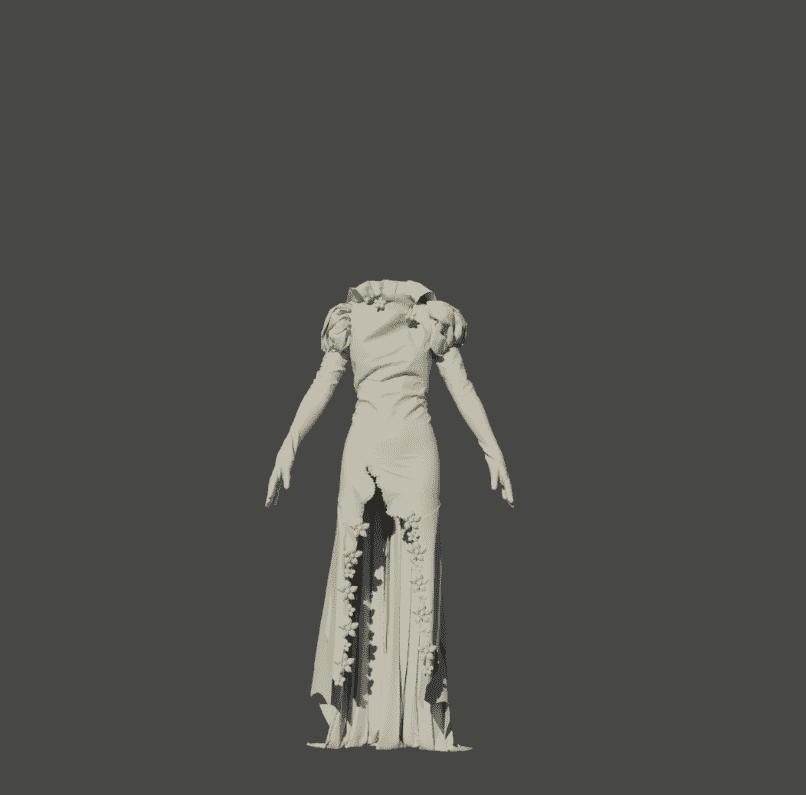

# Fantasy-Collection

多元宇宙是关于宇宙（包括我们生活的那个）平行存在的假设，其中包括存在和可能存在的一切：空间、时间、物质、能量和物理定律。 在多元宇宙中共存的宇宙被称为“平行世界”、“平行宇宙”。 数千年前，出现了连接其他世界与我们世界的各种形状、大小和名称的门户：“众神之门”位于秘鲁的哈尤马卡、埃及的阿布西尔金字塔、英国的巨石阵、玻利维亚的太阳之门、五元素山 越南…。 与连接诸神世界的大门相反，还有连接魔兽世界的大门，一直关闭，但在2023年开启。 猎人是在连接门为 .

转换为 NFT 后，3D 资产将为您最喜爱的游戏带来壮观的 3D 体验，从而颠覆您的 2D 横向滚动世界。不再局限于像素艺术的细节，您现在可以看到更真实的情绪和动作。

玩赚谋生 尽管像加密货币一样，NFT 似乎对大多数人有用，但该行业受到大量投机的困扰，虽然有输家，但绝大多数玩家从交易中获利。

元界就绪在 3D NFT 的推动下，元界正在爆炸，这是互联网的下一次发展。它也不仅仅是游戏或娱乐，因为金融部门希望将元界增长机会纳入其商业模式。吃，并参与具有更广泛社会影响的去中心化经济。

