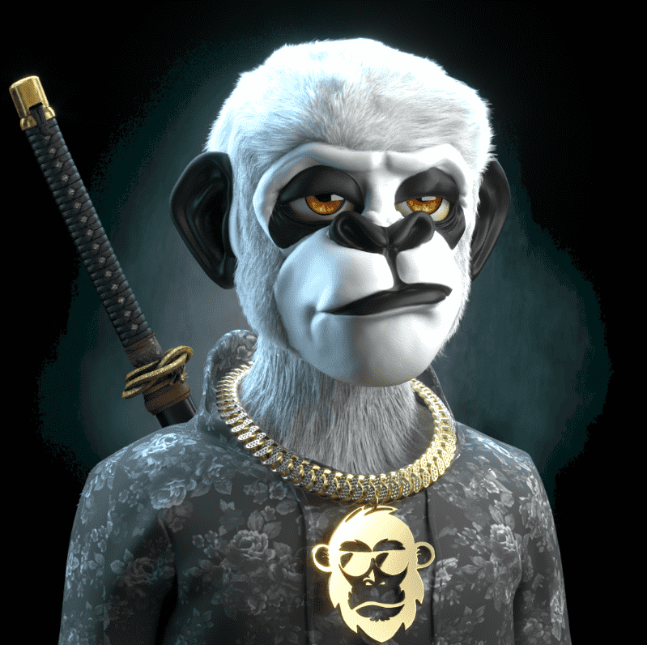

# FASHION APE NFT

Fashion Apes 代表了 2100 种独特的 Apes 的集合，按稀有程度分类，并由数百种元素生成。 时尚猿作为 ERC-721 代币存储在以太坊区块链上，并托管在星际文件系统 (IPFS) 上。我们的主要目标是成为第一批元界时尚先锋之一，并通过高质量的 NFT 为我们的社区提供机会 并为所有持有者提供真正的效用。

FASHION APE NFT NFT - 常见问题（FAQ）
▶ 什么是 FASHION APE NFT？
FASHION APE NFT 是一个 NFT（Non-fungible token）集合。存储在区块链上的数字艺术品集合。
▶ FASHION APE NFT 代币有多少？
总共有 2,100 个 FASHION APE NFT NFT。目前，1,325 位所有者的钱包中至少有一个 FASHION APE NFT NTF。
▶ 最昂贵的 FASHION APE NFT 销售是什么？
最昂贵的 FASHION APE NFT NFT 是 Fashion Ape #780。它于 2022 年 6 月 9 日（3 个月前）以 364.1 美元的价格售出。
▶ 最近卖出了多少FASHION APE NFT？
过去 30 天内售出 4 个 FASHION APE NFT NFT。
▶ 流行的 FASHION APE NFT 替代品有哪些？
许多拥有FASHION APE NFT NFT的用户还拥有 DRRT、 BabyElonWorld、 Milan Quadens的“LOVE”和 CCC Genesis Packaging-Ganji。

