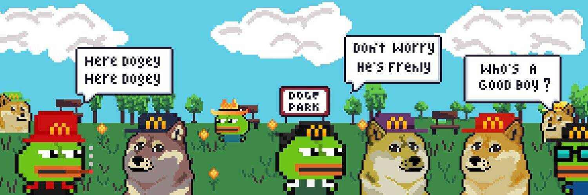

# Fast Food Doge NFT

两个炸锅比一个好，油炸、汉堡翻转的快餐爱好者与 The Doge NFT（互联网上最知名的模因的所有者！）合作，释放了新雇用的快餐狗。

Fast Food Doges 是由 1,696 个独特生成的像素块组成的超稀有集合——Frens Metaverse 的最新方面，由 JPEGDEALERS 的聪明才智创建并得到 PleasrDAO 的支持。

