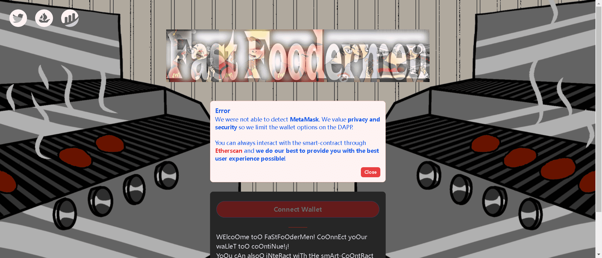

# FastFoodermen

你好！¡！我们是 6969 名快餐店员

嗯，好看的图片，你应该买一些！¡！

▶ 什么是快餐食品系列？
FastFoodermen 是一个 NFT（Non-fungible token）集合。存储在区块链上的数字艺术品集合。

▶ 有多少个快餐爱好者收藏代币？
总共有 5,523 个 FastFoodermen NFT。目前，1,781 位业主的钱包中至少有一个 FastFoodermen

