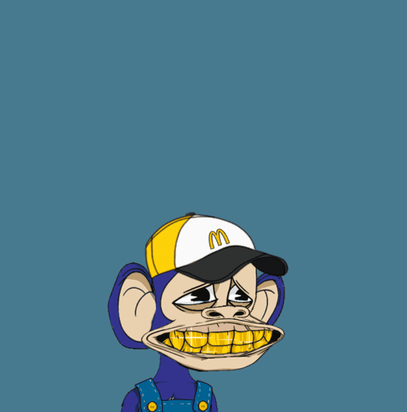

# Fast Food Lil Baby Apes Club

快餐 Lil Baby Ape 俱乐部是 2,000 只独特的快餐主题婴儿猿的集合。 该项目的灵感来自于对抗具有种族主义根源的 NFT 项目的增长趋势，并支持反种族主义教育和慈善机构。 所有权提供了支持由持有人决定的不断发展的减少和消除种族主义形式的途径，以及只有拥有该系列中的 2000 只猿类之一才能进入的独特体验。不隶属于 LBAC 或任何组织。

快餐 Lil Baby Apes Club NFT - 常见问题 (FAQ)
▶ 什么是快餐 Lil Baby Apes 俱乐部？
Fast Food Lil Baby Apes Club 是一个 NFT（非同质代币）系列。存储在区块链上的数字艺术品集合。
▶ 快餐 Lil Baby Apes Club 代币有多少？
总共有 2,000 个快餐 Lil Baby Apes Club NFT。目前，832 位业主的钱包中至少有一份快餐 Lil Baby Apes Club NTF。
▶ 什么是快餐 Lil Baby Apes Club 最贵的促销活动？
售出的最昂贵的快餐 Lil Baby Apes Club NFT 是 Fast Food Lil Baby Apes Club #367。它于 2022 年 7 月 3 日（2 个月前）以 0.9 美元的价格出售。
▶ 最近卖了多少快餐Lil Baby Apes Club？
过去 30 天内售出 1 个 Fast Food Lil Baby Apes Club NFT。

