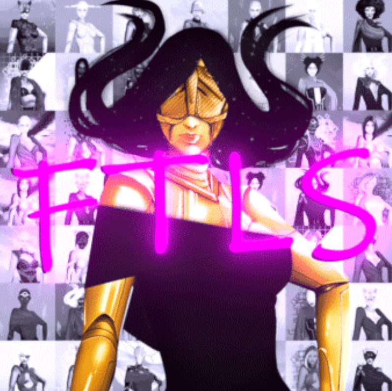

# Fatales

我们是一个加密爱好者团队，在 NFT 领域建立真正的价值和实用性理念

FTLS 是一个全女性收藏，拥有令人惊叹的艺术，持有者拥有完整的知识产权。

收集这些 NFT 以打开 IRL、web2、web3、metaverse 的大门。

我们正在与空间领域的创新者合作，投资、建设，始终为我们的社区创造更多机会。

Fatales NFT - 常见问题（FAQ）
▶ 什么是宿命？
Fatales 是一个 NFT（不可替代令牌）集合。存储在区块链上的数字艺术品集合。
▶ 有多少个 Fatales 代币？
总共有 10,000 个 Fatales NFT。目前，3,761 位所有者的钱包中至少有一个 Fatales NTF。
▶ 什么是最昂贵的 Fatales 销售？
出售的最昂贵的 Fatales NFT 是 . 它于 2022-08-12（22 天前）以 70.3 美元的价格售出。
▶ 最近卖出了多少 Fatales？
过去 30 天内售出了 138 个 Fatales NFT。
▶ Fatales 的价格是多少？
在过去 30 天里，最便宜的 Fatales NFT 销售额低于 14 美元，最高销售额超过 55 美元。在过去 30 天内，Fatales NFT 的中位价格为 23 美元。
▶ 什么是流行的 Fatales 替代品？
许多拥有 Fatales NFT 的用户还拥有 Secret Agent Men、 NOOBS NFT、 Sewer Rat Social Club和 ELVEN。

