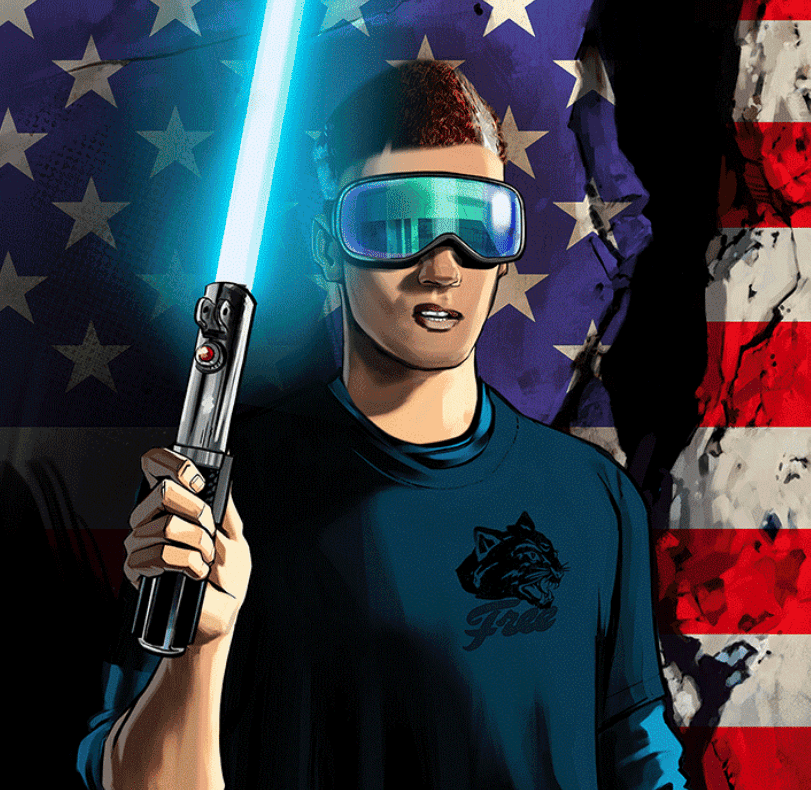

# Fear City by Stephen Bliss

恐惧之城汇集了 3,333 部独特的杰作、6 个强大的角色，每个角色都有自己的故事要讲述。欢迎来到恐惧之城，来势汹汹的帮派和腐败的政客争夺恐惧之城的控制权。 Fear City 诞生于 Stephen Bliss（负责标志性侠盗猎车手插图的艺术家）的创意表达。 我们的目标是利用 Web3 技术的力量，在漫画书、动画系列、视频游戏等等中将恐惧之城黑暗而美丽的虚拟世界带入生活。 每个 Fear City 角色都是 Fear City 知识产权、独家商品、数字和 IRL 活动的关键，并将解锁更多实用程序和惊喜。享受您在 Fear City 的逗留。

斯蒂芬的幸福

在 Rockstar Games 工作的 15 年中，Stephen Bliss 建立了极具辨识度的插图风格，定义了游戏大型特许经营权侠盗猎车手 (Grand Theft Auto) 的外观、感觉和定位。

