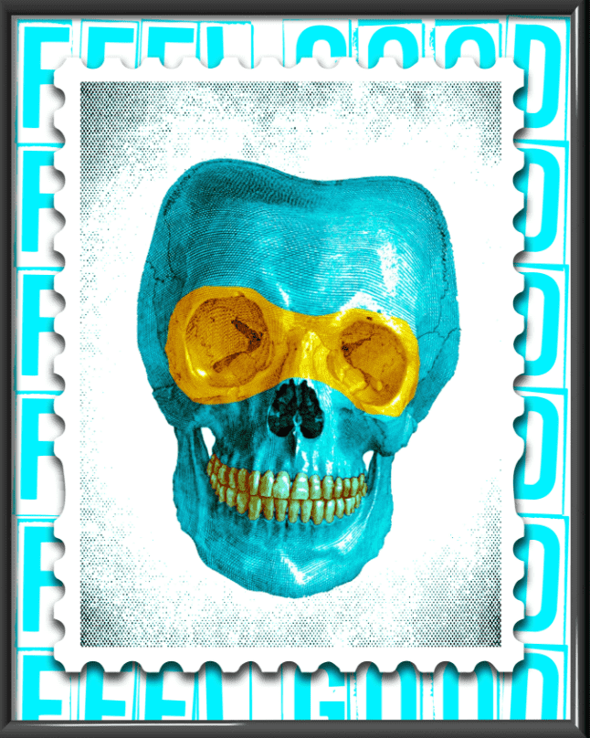

# FEEL GOOD NFT

要购买感觉良好的产品，请访问 OPENSEA
首创的 NFT 系列
FEEL GOOD NFT 系列正在开辟新天地。 一个随机生成的集合，其中每一件艺术品都是由来自传统艺术界的世界知名艺术家设计和创作的。 这个独特的系列将于 10 月在以太坊上推出。 加入我们的 Discord 以了解最新信息。

三位知名艺术家

三种独特的风格

Prodigy 主唱兼艺术家 Maxim、混合媒体艺术家 Dan Pearce 和涂鸦标签大师 Opake 合作打造了这个独特的实验性 NFT 系列。Feel Good 在这里为快速发展的 NFT 空间带来兴奋、积极和高水准的艺术作品。

丹·皮尔斯

Dan Pearce 是一位混合媒体艺术家，他的作品被 Idris Elba、Boy George、Anthony Joshua 和 50 Cent 的所有人收藏。他被评为“英国最具收藏价值的新兴艺术家之一”，他的作品采用喷漆、手绘丙烯酸树脂、透镜、霓虹灯、3D 物体、纹理树脂、金箔和拼贴画，以及他自己的摄影和街头艺术.

Dan Pearce 的创新混合媒体肖像将现代街头艺术与 Warhol 和 Lichtenstein 的影响融合在一起，以一种独特的能量、色彩和纹理可控爆炸。

