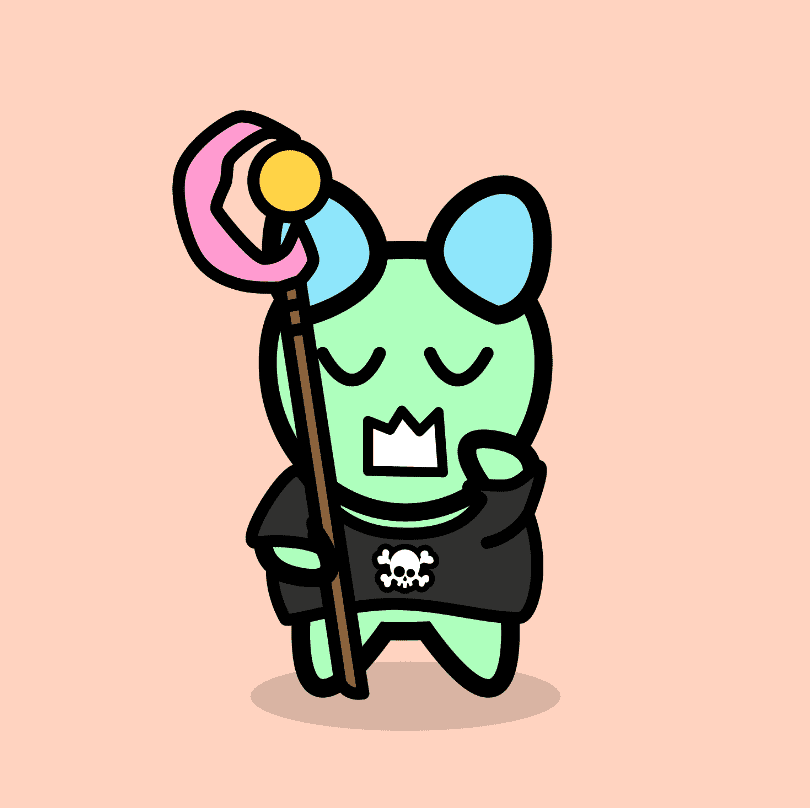

# Feel Gang

Feel Gang NFT 在过去 7 天内售出 12 次。Feel Gang 的总销售额为 22.61 美元。一个 Feel Gang NFT 的平均价格为 1.9 美元。共有 1,945 名 Feel Gang 所有者，拥有 10,000 个代币的总供应量。

Feel Gang 是他们来自 Felia 星球的臭名昭著帮派的最后 10,000 名幸存者。所有成员都分散了，在元宇宙中寻找新家。

Feel Gang NFT - 常见问题（FAQ）
▶ 什么是感觉帮派？
Feel Gang 是一个 NFT（不可替代代币）集合。存储在区块链上的数字艺术品集合。
▶ 有多少Feel Gang代币？
总共有 10,000 个 Feel Gang NFT。目前，1,945 位车主的钱包中至少有一个 Feel Gang NTF。
▶ 最昂贵的Feel Gang销售是什么？
售出的最昂贵的 Feel Gang NFT 是 Feel Gang Collection #6489。它于 2022-06-08（3 个月前）以 18.1 美元的价格售出。
▶最近卖出了多少Feel Gang？
过去 30 天内售出 14 个 Feel Gang NFT。
▶ Feel Gang 的费用是多少？
在过去的 30 天里，Feel Gang 最便宜的 NFT 销售额低于 0 美元，最高销售额超过 14 美元。在过去 30 天内，Feel Gang NFT 的中位价格为 1 美元。
▶ 什么是流行的 Feel Gang 替代品？
许多拥有 Feel Gang NFT 的用户还拥有 Cool Cats Expansion、 Gator-Raid Official、 0xWOW和 0xRKL。

