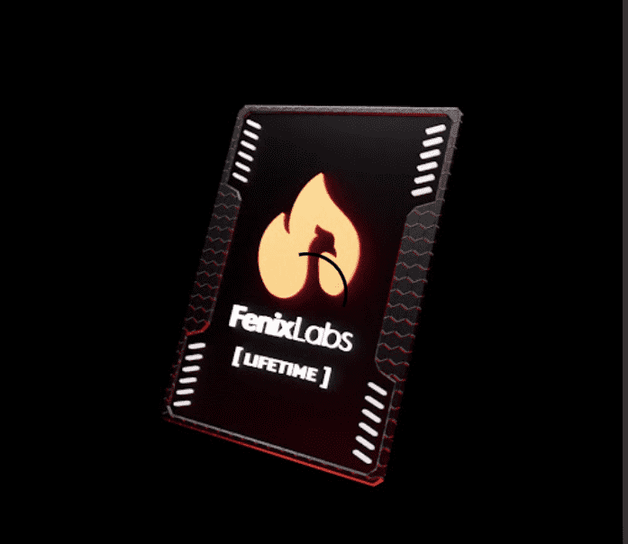

# FenixLabs

FenixLabs NFT 在过去 7 天内售出 49 次。FenixLabs 的总销售额为 40.34 万美元。FenixLabs NFT 的平均价格为 823.2 美元。共有 528 名 FenixLabs 所有者，拥有 682 个代币的总供应量。

从NFT 市场上的 OG 工具之一[RyzeNFT](https://opensea.io/collection/ryzenlabs)的灰烬中重生。

[FenixLabs Automations](https://automations.fenixlabs.io/)是一个功能齐全的 Web 应用程序，旨在最大限度地利用您的 NFT 业务。

FenixLabs NFT - 常见问题（FAQ）
▶ 什么是 FenixLabs？
FenixLabs 是一个 NFT（不可替代令牌）集合。存储在区块链上的数字艺术品集合。
▶ 有多少 FenixLabs 代币？
总共有 682 个 FenixLabs NFT。目前 528 位所有者的钱包中至少有一个 FenixLabs NTF。
▶ 最昂贵的 FenixLabs 销售是什么？
出售的最昂贵的 FenixLabs NFT 是 FenixLabs #530。它于 2022 年 6 月 5 日（3 个月前）以 160 美元的价格售出。
▶ 最近卖出了多少 FenixLabs？
过去 30 天内售出了 189 个 FenixLabs NFT。
▶ FenixLabs 的费用是多少？
过去 30 天，FenixLabs NFT 最便宜的销售额低于 466 美元，最高销售额超过 1358 美元。FenixLabs NFT 在过去 30 天内的中位价格为 786 美元。
▶ 什么是流行的 FenixLabs 替代品？
许多拥有 FenixLabs NFT 的用户还拥有 NFT Sensei Lifetime Access、 freshdrops、 Origins NFT和 Alpha X Genesis Pass。

