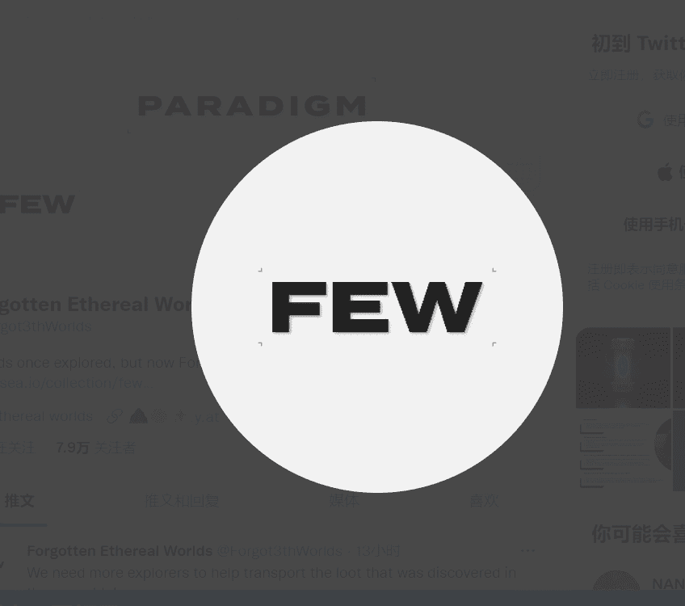

# FEW Paradigm

从虚空穿过裂缝

Forgotten Ethereal Worlds 是一个景观 NFT 项目。
350 创世纪。5000 总供应量。

这些世界将包括被动质押、代币生成和等级提升。生成的代币 $FRAGZ 允许探索者唤醒他们被遗忘的虚灵世界的最大潜力。它从加速世界发展和改写历史开始，真正成为自己的。

穿越裂缝冒险。
揭开遗忘之物。

从虚空穿过裂缝

Forgotten Ethereal Worlds 是一个景观 NFT 项目。
350 创世纪。5000 总供应量。

这些世界将包括被动质押、代币生成和等级提升。生成的代币 $FRAGZ 允许探索者唤醒他们被遗忘的虚灵世界的最大潜力。它从加速世界发展和改写历史开始，真正成为自己的。

穿越裂缝冒险。揭开遗忘之物。

登高从我们的第一个开始

核心团队位于墨尔本和马来西亚，拥有加密、交易、技术和艺术方面的经验。我们的目标是创造与社区一起成长的美丽作品，同时提供价值。

