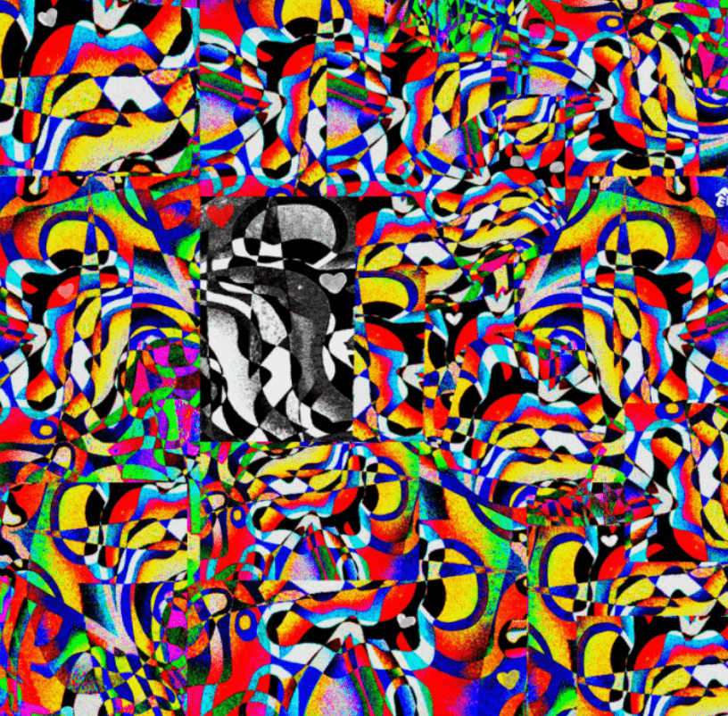

# FEWOCiOUS

FEWOCiOUS 创作的艺术代表了他们记忆的快照和心中的一面镜子，一位 17 岁的艺术家，在内华达州拉斯维加斯出生和长大，目前正在读高中，Fewocious 在中学时发现了他们对艺术的热爱，因为 上课无聊。 FEWOCiOUS 决定画同龄人的漫画来打发时间。 他们的艺术也是他们处理成长和使用艺术作为日记的另一种形式的一种方式。

“我喜欢艺术。” 这是您经常听到 FEWOCiOUS 说的话，如果您需要了解有关这位 18 岁艺术界冉冉升起的新星的一件事，那就是它。代表他记忆的快照和他心中的一面镜子，他对创作的热情在每一件作品中都闪耀着光芒，所有这些都散发着活力，象征着感情的力量。现在住在西雅图，FEWOCiOUS 13 岁时在他的家乡拉斯维加斯开始创作艺术。他对数字艺术的涉足是作为避难所而诞生的。FEWOCiOUS 在 17 岁时卖出了他的第一幅画，并在一年之内，通过一系列成功的 NFT 下降，能够搬到他在太平洋西北部的梦想城市继续创作。

他最近推出的 FEWO WORLD 是与融合时尚和游戏现实的下一代运动鞋和收藏品创作者 RTFKT 的开创性合作。每个 NFT 都附带一双现实世界的鞋子或其他时尚单品，在几分钟内产生了超过 300 万美元的销售额。FEWOCiOUS 的最新作品“Fabricated Fairytales”于 2021 年 3 月与最好的朋友 parrott_ism、odious 和 Jonathan Wolfe 合作发布。

“FEWOCiOUS 以同样的方式追随 [Basquiat 和 Barbara Kruger]，”Kulture Hub 写道，“他们对视觉和书面图像的动态使用。” FEWOCiOUS 在已经开创性的 NFT 艺术生涯仅 9 个月后，才刚刚开始挖掘他的无限潜力和“在数字空间中迅速崛起的形象”（Hypebeast）。

最终，他们发现了 Art Twitter 社区，并决定也开始发布自己的作品。从廉价复印纸上的锐利涂鸦开始，到使用他们的 iPad pro 和 Procreate 应用程序进行数字绘图，始终根据他们的感受进行创作。对他们来说，活力象征着感觉的力量。有时，在物理空间中尝试使用丙烯酸涂料。虽然，Fewocious 从来没有上过艺术课，但他们把所有的时间都花在了吸收艺术书籍上，并尽可能多地向艺术家学习。最近，学习如何为他们的作品制作动画以扩展流动性并展示呼吸动作。

