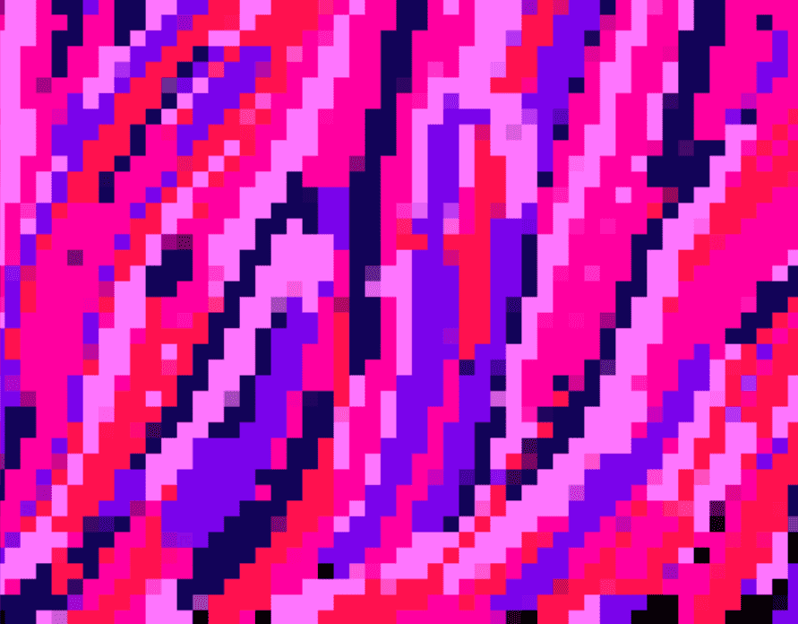

# Filaments - Generative Pixel Art

细丝 - 生成像素艺术经过 细丝
细丝是无限动画的。如果你让它运行 100 年，它仍然会向你展示一些独特的东西。
只需按一下按钮，您就可以使用它制作 Twitter 横幅（或个人资料图片背景等）。
所有特征生成都在链上（没有合约调用者），因此可以证明是随机的。
所有展示艺术作品的代码都永久不可变地存储在链上（p5js 库除外）并镜像到 IPFS。
30 天后，铸币将被禁用，无人认领的艺术品将被生成和烧毁，直到时间结束。
由ab用爱制作。每个灯丝都是免费铸造的（+gas），并且通过 ENS 白名单限制为一个人。没有网站。

