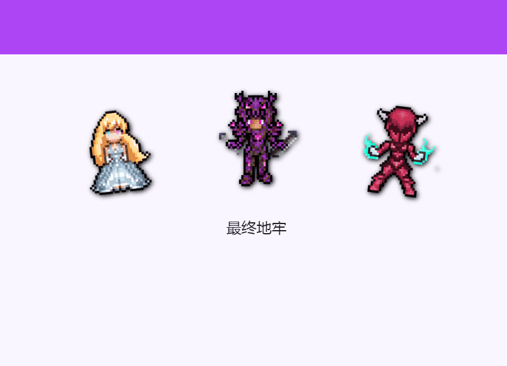

# Final Dungeon

哥布林杀手专为杀戮而生。

▶ 什么是最终地牢？
Final Dungeon 是一个 NFT（非同质代币）集合。存储在区块链上的数字艺术品集合。
▶ 最终地牢代币有多少？
总共有 5,000 个 Final Dungeon NFT。目前 4,212 位所有者的钱包中至少有一个 Final Dungeon NTF。
▶ 最昂贵的最终地牢特卖是什么？
售出的最昂贵的 Final Dungeon NFT 是 Goblin Hunter Aria。它于 2022-06-08（3 个月前）以 363.8 美元的价格售出。
▶ 最近卖出了多少最终地牢？
过去 30 天内售出了 400 个 Final Dungeon NFT。
▶ 最终地牢需要多少钱？
在过去 30 天里，Final Dungeon NFT 最便宜的销售额低于 4 美元，最高销售额超过 67 美元。过去 30 天 Final Dungeon NFT 的中位价格为 36 美元。

