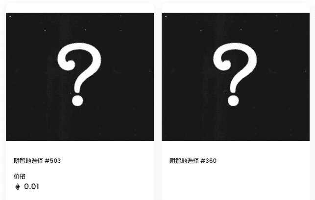

# Find the Riddler

谜语人，本名爱德华·尼格玛，是一名出现在DC漫画所出版的漫画中的超级反派。 由比尔·芬格与Dick Sprang所创作，初次登场于《侦探漫画》#140。 在IGN所列出的漫画史上最受欢迎的一百名超级反派中，谜语人名列第五十九名。

##### ▶ 什么是“寻找谜语人”？

Find the Riddler 是一个 NFT（不可替代令牌）集合。存储在区块链上的数字艺术品的集合。

##### ▶ 有多少个找到谜语代币存在？

总共有555个Find the Riddler NFT.目前有146个所有者在他们的钱包里至少有一个Find the Riddler NTF。

##### ▶ 最近卖了多少《寻找谜语人》？

在过去 30 天内售出了 0 个 Find the Riddler NFT。
