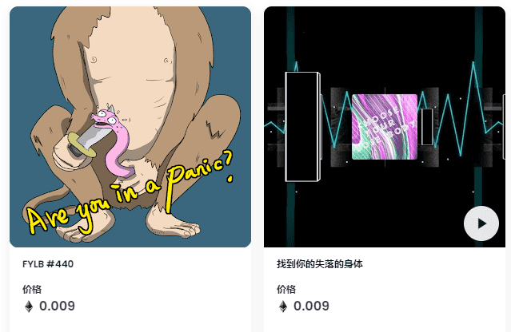

# Find Your LostBody

寻找你失去的身体哇，你又找到了我！前2000年的LostBody是免费的，每个帐户只能铸造一次。

只有24个Bayc支架可以找到您的特殊失物。请选择您拥有的精彩的Bayc TokenId。

##### ▶ 什么是Find Your LostBody_？

查找您的LostBody_是一个 NFT（不可替代令牌）集合。存储在区块链上的数字艺术品的集合。

##### ▶ 有多少个“Find Your LostBody令牌”存在？

总共有4，103个“查找您的LostBody_NFT”。目前，983个所有者的钱包中至少有一个“查找您的LostBody_NTF”。

##### ▶ 找到您的LostBody_销售中最贵的是什么？

NFT出售的最昂贵的Find Your LostBody_是LOSTBODY #568。它在2022-06-29（2个月前）以16.5美元的价格出售。

##### ▶ 最近售出了多少LostBody_？

在过去 30 天内售出了 80 个“查找您的LostBody_ NFT。

##### ▶ “查找您的LostBody_的费用是多少？

在过去的30天里，最便宜的Find Your LostBody_NFT销售额低于3美元，最高销售额超过7美元。查找您的LostBody_NFT的中位价格是过去30天内的4美元。
