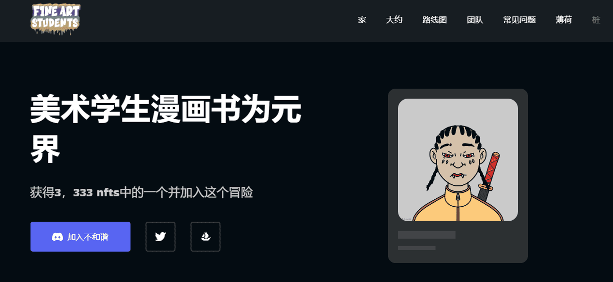

# Fine Art Student

美术学生是一个由才华横溢的艺术学生手绘的3，333个NFT项目！我们的NFT非常独特，它位于ETH区块链上。我们为您提供了一些未来主义的计划。别忘了，这只是我们未来的一个开始。他们可以被抵押，您将能够通过抵押赚取$FAS。

此外，您可以将NFT用于您的Twitter个人资料图片。如果你在这个舞台上，你非常幸运。先到先得。

这是一个免费项目，所以我们只期待你发自内心的支持。该项目的第一个持有者将从我们的下一代项目中获得1（一）个免费的NFT，这不会像这样免费！我们的目标是获得您可以看到的最大社区，并带着它去月球。我们希望通过考虑您的所有想法来决定我们项目的未来。请仔细看看我们的路线图，我们还有很长的路要走！

