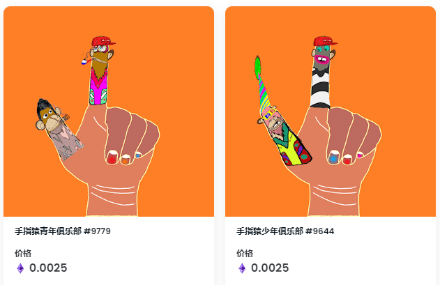

# Fingers Ape Young Club

**Fingers Ape Young Club手指猿少年俱乐部**

欢迎来到手指猿少年俱乐部的家。发现此系列中最好的物品。Fingers Ape Young Club是一系列独特的F_A_Y_C NFT - 独特的数字收藏品APE模因，存在于区块链上。#F_A_Y_C是一种文化转变。

10000个不同区域面孔的干净集合生活在手指的手上，创造了一个超越互联网进入现实世界的良性社区。

**▶ 什么是Fingers Ape Young Club手指猿幼俱乐部？**
Fingers Ape Young Club是NFT（不可替代令牌）的集合。存储在区块链上的数字艺术品的集合。

**▶ 有多少个手指猿青年俱乐部代币存在？**
总共有9，746个Finger Ape Young Club NFT.目前有287个所有者在他们的钱包里至少有一个Fingers Ape Young Club NTF。

**▶ 最昂贵的手指猿幼俱乐部销售是什么？**
最昂贵的Fingers Ape Young Club NFT出售的是Fingers Ape Young Club #10。它在2022-06-05（3个月前）以$ 182的价格出售。

**▶ 最近卖了多少只手指猿幼俱乐部？**
在过去的30天内售出了5个手指猿猴俱乐部NFT。
