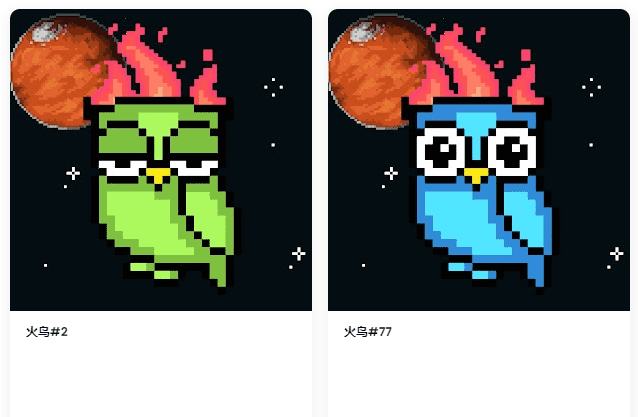

# FIRE BIRDS NFT

火鸟是嵌套在Avalanche区块链上的5，555只独特鸟类的集合。火鸟通过每周的奖励分配和赠品，为较小的投资者提供了较低的进入凤凰城社区资本强大的被动收入的机会。

100 个 Fire Bird PPP，可解锁私人俱乐部会员资格和其他优惠。最亮的BIRD NFT项目。3，134只独特生成的火鸟将在以太坊区块链上永远燃烧。

**▶ 什么是火鸟NFT？**
FIRE BIRDS NFT是NFT（不可替代令牌）集合。存储在区块链上的数字艺术品的集合。

**▶ 有多少火鸟NFT代币存在？**
总共有100个FIRE BIRDS NFT NFT.目前有21个所有者在他们的钱包中至少有一个FIRE BIRDS NFT NTF。

**▶ 最近卖了多少只火鸟NFT？**
在过去的30天内售出了0个FIRE BIRDS NFT NFT NFT。
