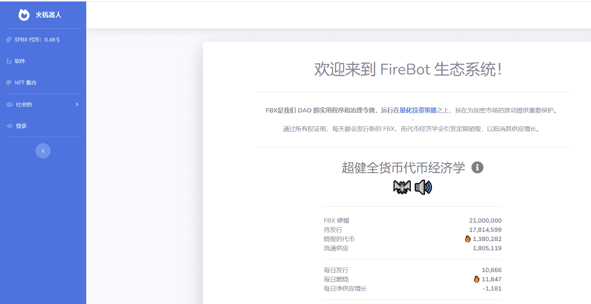

# FireBot.gg

一组独特的数字机器人在 Polygon 区块链上铸造为不可替代的代币。

我们的机器人已经从超过 1.27 亿个可能的特征组合中生成，这些特征组合来自各种背景、身体、头部、眼睛、嘴巴和头饰。

FBX是我们 DAO 的实用程序和治理令牌，运行在量化投资策略之上，旨在为加密市场的波动提供重要保护。

通过所有权证明，每天都会发行新的 FBX，而代币经济学会引发定期销毁，以抵消其供应增长。将您的加密货币放入 FireVault！ 

