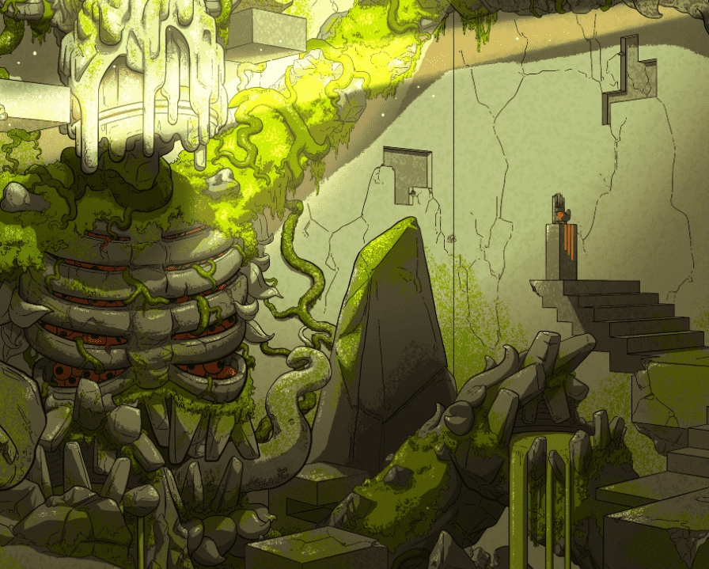

# First APELIST Ticket

第一张 APELIST 门票您进入机会之殿的钥匙 - 让您可以访问独家白名单、工具和 web3 机会。Ape List 是BAYC、MAYC、CloneX、AZUKI、Meebits 和 Damien Hirst 持有者专属的私人 alpha 社区。请注意：此 NFT 的实用程序是上述集合独有的。

▶ 第一张 APELIST 门票代币有多少？
总共有 2个 第一张 APELIST 门票。目前，1 位所有者的钱包中至少有一个 第一张 APELIST 门票。

什么是第一张 APELIST 门票

第一张 APELIST 门票（Non-fungible token）集合。存储在区块链上的数字艺术品集合。

