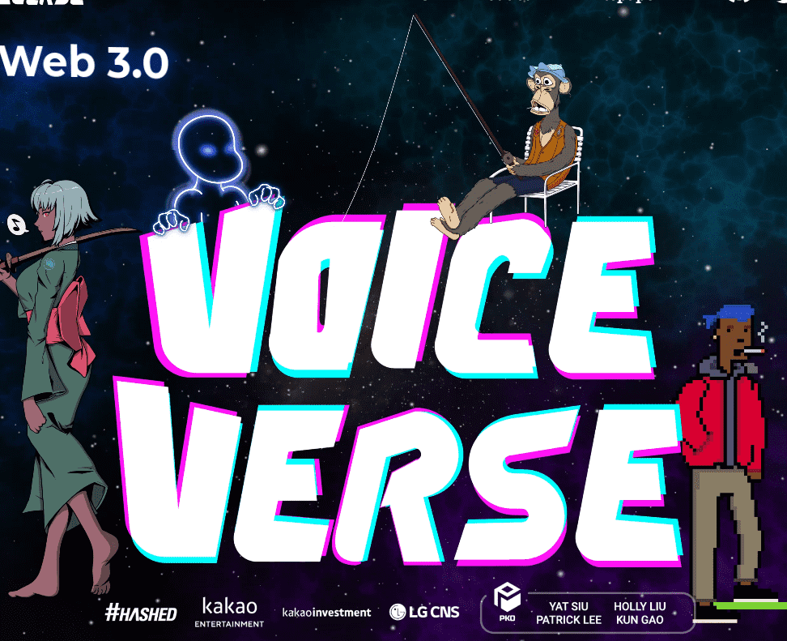

# First Voiceverse NFT

使用我们的文本转语音 (TTS) 套件让您的 NFT 说话。支持 BAYC、PUNKS、mfers 等。

Voiceverse 旨在为 Web3.0 的声音提供动力。现在正在创建的每张个人资料图片 NFT 都在为广阔的元宇宙世界做准备。它们提供了人们想怎么看就怎么看的自由。你想成为一只猫吗？当然！等等，猿？无论你想要什么！我们相信，声音也需要同样的自由。一个人的声音与他们的身份有着独特的联系。一旦你听到那个人的声音，它就会立即让你想起他们，以及你与他们的回忆。声音是个人的。声音带出情感。声音是独一无二的。声音是一个人身份的重要方面。

