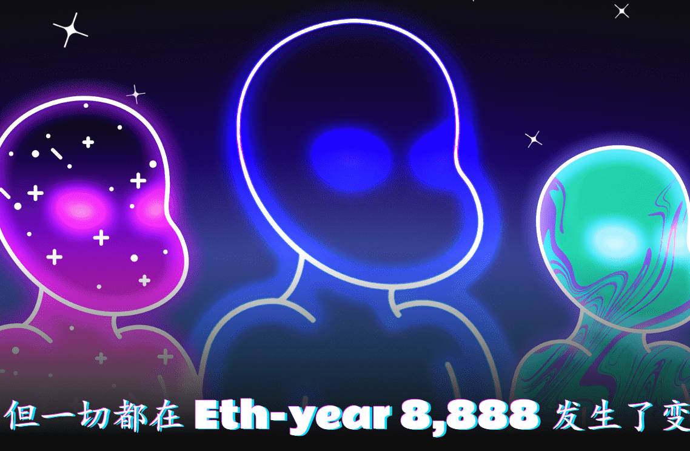

# First Voiceverse Ticket

​	

化名将是 Web3.0 的关键。人们会想要一个完整的、全新的虚拟身份来代表自己，而语音是其中的关键部分。少数真正喜欢他们真实声音的人会使用它，但这就是重点，对吗？*选择的自由。*

这就是我们创建 Voiceverse 和世界上第一个 Voice NFT 的原因。语音 NFT 让您可以在虚拟世界中使用由人工智能技术驱动的独特语音。

我们愿意打赌，虚拟世界中的主要交流媒介将是语音。如果有十亿个视觉身份，那么至少也会有十亿个声音身份。

这是为了建立数十亿个独特的声音！

