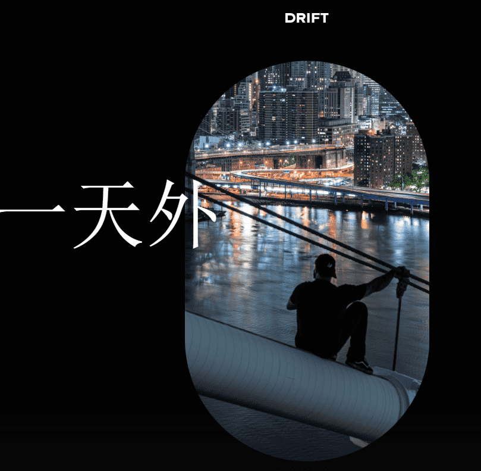

# First Day Out by DrifterShoots

艾萨克·赖特 (Isaac Wright) 是一名光荣退休的陆军特种作战老兵，他已经六年了，他开始拍摄摄影以应对精神疾病，特别是 PTSD 和抑郁症。他的作品涉及从前所未有的角度捕捉世界、

我静静地停在桥上，凝视着夜色。我转向桥，像往常一样抬起头，提醒自己这不会永远持续下去。翻上隐藏的梯子，我一头扎进了夜色中，一颗破碎的心的锁链随着我走的更高而脱落。我静静地坐在桥上，眼睛在城市的灯光下闪闪发光，出租车的声音和稍纵即逝的青春充斥着下面的空气。我看着看着看着，眼里噙满泪水，过了这么久，这一切都还牵扯着我。我无法撼动梦想，在寒冷的牢房墙壁和蜷缩在肮脏的牢房地板上度过的夜晚，在军官的枪触到我的后脑勺之后，我还在这里。剩下的一切都是神圣的，你发现在之后你拥有了你需要的一切，在那一刻我知道我注定要继续做梦。

