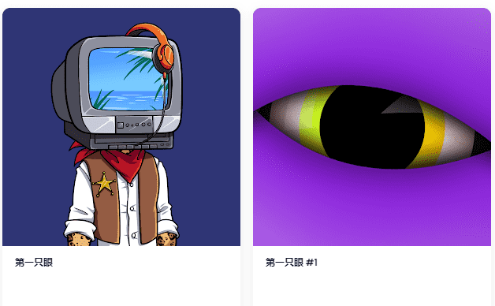

# FirstEyes V2

欢迎来到OpenSea上的FirstEyes V2之家。发现此系列中最好的物品。

FirstEyes V2是一个NFT（不可替代的令牌）集合。存储在以太坊区块链上的数字艺术品的集合。FirstEyes V2是存储在以太坊区块链上的7件NFT集合。FirstEyes V2 NFT的当前底价为0 ETH - $ 0.00。FirstEyes V2的总销量为0 ETH - $ 0.00，所有者为0。

**▶ 什么是FirstEyes V2？**
FirstEyes V2是一个NFT（不可替代令牌）集合。存储在区块链上的数字艺术品的集合。

**▶ 有多少个FirstEyes V2代币存在？**
总共有7个FirstEyes V2 NFT.目前有4个所有者在他们的钱包中至少有一个FirstEyes V2 NTF。

**▶ 最昂贵的FirstEyes V2销售是什么？**
最昂贵的FirstEyes V2 NFT是First Eyes #2。它在2022-06-26（2个月前）以5.5美元的价格出售。
