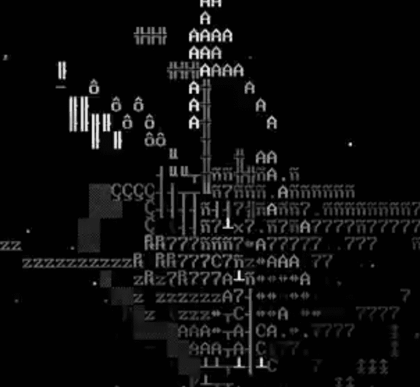

# First First NFTs

受 NFT 艺术最大持久性重要性的启发，我提出了一种新方法，用于有效地链式存储可表示为模型和参数输出的媒体文件。典型的 NFT 将媒体存储在 IPFS 上，只有[参考哈希存储在区块链上。 [现有方法]将模型代码和参数存储在链上，以便在浏览器中或使用外部库呈现。这引入了对浏览器技术（正在快速变化）以及在某些情况下是外部库的依赖。我建议存储**用 C 语言编写的自包含代码** 直接输出可编码为声音和视觉媒体的原始数字数据。由于以太坊已经依赖于 C 编译器，用 C 编写模型代码不会引入新的依赖关系，从而增加了媒体将在以太坊网络的生命周期内得到完好保存的信心。

此外，我还展示了一系列利用这种技术的生成视听艺术作品。

