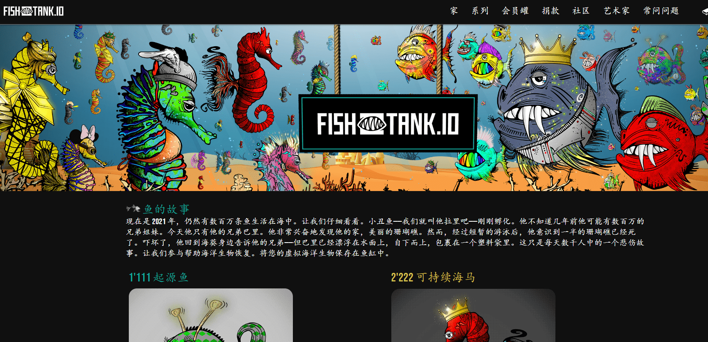

# Fish Tank NFT

现在是 2021 年，仍然有数百万条鱼生活在海中。让我们仔细看看。小丑鱼——我们就叫他拉里吧——刚刚孵化。他不知道几年前他可能有数百万的兄弟姐妹。今天他只有他的兄弟巴里。他非常兴奋地发现他的家，美丽的珊瑚礁。然而，经过短暂的游泳后，他意识到一半的珊瑚礁已经死了。吓坏了，他回到海葵身边告诉他的兄弟——但巴里已经漂浮在水面上，自下而上，包裹在一个塑料袋里。这只是每天数千人中的一个悲伤故事。让我们参与帮助海洋生物恢复。将您的虚拟海洋生物保存在鱼缸中。

