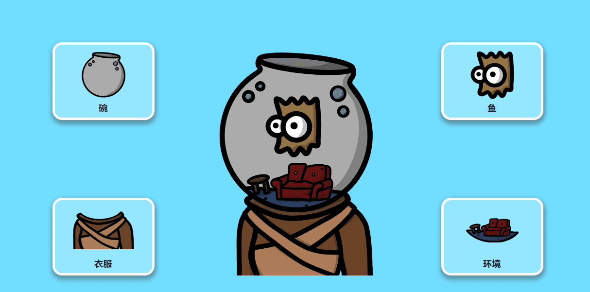

# Fishbowl Heads

**什么是Fishbowl Heads？**

Fishbowl Heads是1500个超级可爱的Fish主题数字头像NFT收藏品的集合，在以太坊区块链上游泳。

每个Fishbowl Heads NFT都是以编程方式生成的，由衣服，碗，环境和鱼的独特组合组成，跨越192个特征，随机分配不同的稀有度，在以太坊区块链上铸造为ERC-721令牌，媒体和元数据托管在IPFS上。

艺术品干净，可爱，适合家庭，吸引了从孩子，新生儿，成人甚至老年人的广泛受众。毋庸置疑，它们构成了一张可爱的个人资料照片。

