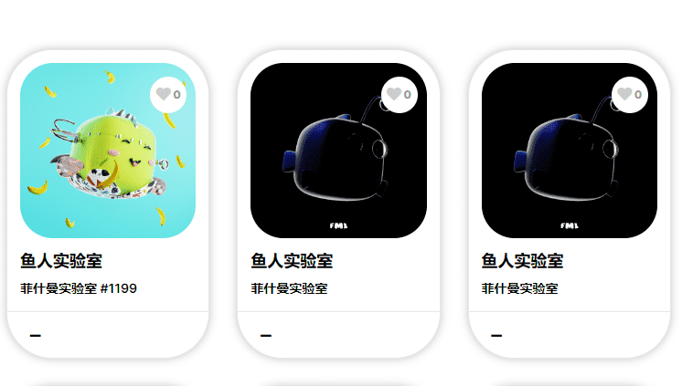

# Fishmans Laboratory Nft Official

**菲什曼斯实验室Nft官方**

亚洲第一个NFT交易所，可交易以太坊Ethereum，Polygon及Solana等多种区块链的NFT，是中国、香港、台湾、新加坡、日本及韩国最大的NFT 交易平台 跳至内容 Search NFT市场 热门NFT 。

有限的NFT收藏了12121条鱼，试图逃离菲什曼博士的邪恶计划，前往公海。

在制作终极鱼的过程中，菲什曼博士赋予了12121条鱼生命，每条鱼都奇特而独特。每条鱼都将由一个强大的热情的Finions社区铸造，以一声巨响进入元宇宙！

