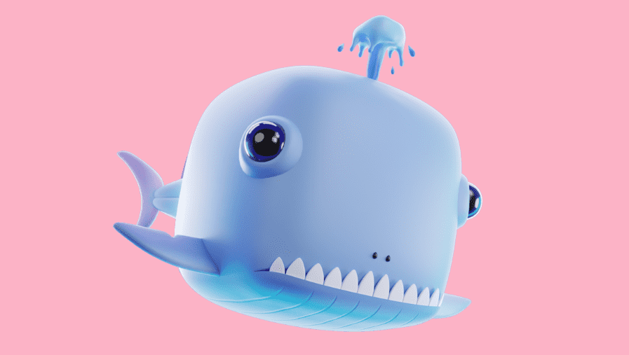

# Fishmans Laboratory Official

与其他实验室一起，Fishman Lab致力于将*Mimulus*属开发为资源丰富的进化遗传学和基因组学模型系统。猴花种类繁多，实验性强。

鱼人实验室白名单销售现已上线！鱼人实验室白名单销售上线！

2222 Fish试图逃脱Fishman博士的邪恶计划，前往公海！

**▶ 什么是Fishmans Laboratory Official - 官方实验？**
Fishman's Laboratory - Official Experiments是NFT（不可替代令牌）的集合。存储在区块链上的数字艺术品的集合。

**▶ 有多少Fishmans Laboratory Official - 官方实验代币存在？**
总共有1，663个Fishman's Laboratory - Official Experiments NFT.目前，895个所有者的钱包里至少有一个Fishman's Laboratory - Official Experiments NTF。

**▶ 什么是最昂贵的Fishmans Laboratory Official - 官方实验销售？**
最昂贵的Fishman's Laboratory - 官方实验NFT出售的是Fishman's Laboratory。它在2022-06-11（3个月前）以$ 7.9的价格出售。
