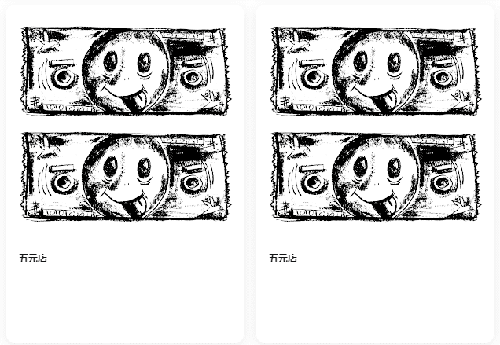

# Five Dollar Shop

**▶ 什么是Five Dollar Shop？**
Five Dollar Shop是NFT（不可替代令牌）的集合。存储在区块链上的数字艺术品的集合。

**▶ 有多少个Five Dollar Shop代币存在？**
总共有512个五美元商店NFT.目前有132个所有者在他们的钱包中至少有一个五美元商店NTF。

Five Dollar Shop里并不是所有商品都是五元钱。这不是钱，这是艺术 512 美元的美元是免费的 我的艺术是免费的 艺术是免费的。

选购艺术品全都免费，是的，你没看错，成为小众艺术家，做最好的自己。

