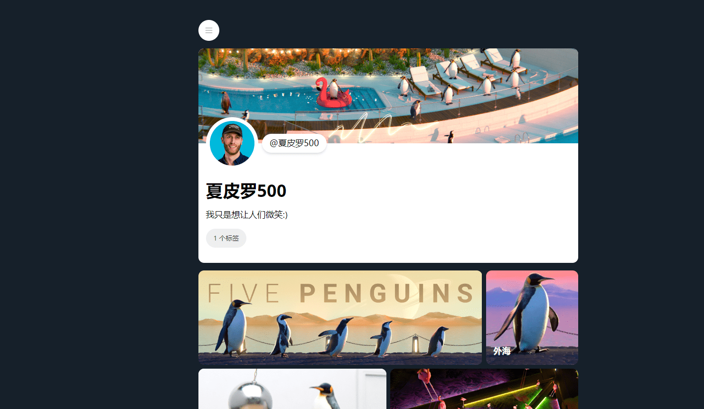

# Five Penguins

五只企鹅是一个收藏的音乐会可视化工具，任何人都可以免费使用。这是 Gavin Shapiro 的生成艺术系列，可在以太坊区块链上收集，旨在适合您的 Twitter 横幅。在精神上类似于在 ArtBlocks 上发现的生成集合，这首先是一个艺术发布，并且没有路线图！只是雄伟，无休止地行进的企鹅。有时是蜜蜂。

该系列中的 3,125 个小队由 5 种不同企鹅类型在 5 个不同位置 (5^5) 的所有可能组合组成。每种组合只有一个，这些组合的稀有性被视为扑克牌（因此获得五只相同的企鹅比一对或三只同类要难得多。）。然后，每个小队都会获得一个随机背景，并有机会生成具有特殊环境特征的角色。

