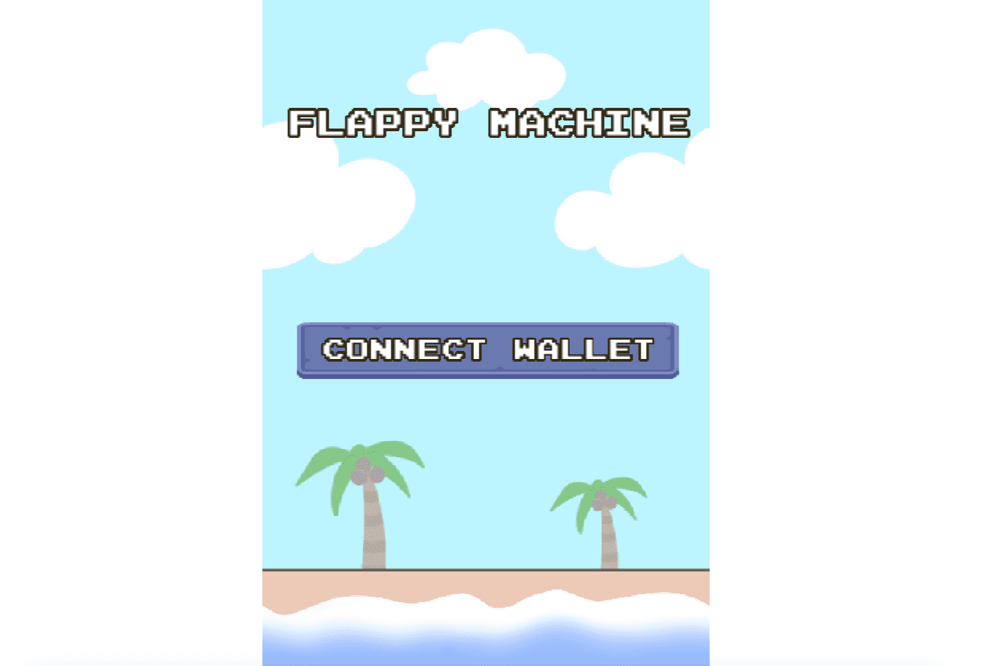

# Flappy Machine

我打赌你不能得分超过 60。试试看热情的独立游戏*制作人*。... 游戏开发商 Dong Nguyen 在 2014 年凭借*Flappy* Bird 掀起了波澜，这是一款超高难度的手机游戏，曾一度席卷*计算机使用**机器*学习学习玩*Flappy* Bird 游戏。只是一个使用 Unity*机器*学习代理库的小项目。*Flappy Machine*统计；用户。55. 30.95%。Dapp 用户图表；交易。135. 23.85%。Dapp 交易图表；体积。2.74 美元 · 77.92%。Dapp 交易量图表。Bey Tek Games的*Flappy* Bird 推销游戏让您玩流行的*Flappy* Bird 游戏，赢取丰厚奖品！扑向胜利之路。2022年2月8日—在这个游戏中，你帮助*机器*生存。将著名的鸟类游戏与一些添加元素混合在一起。使用热闹的画外音，游戏旨在...

