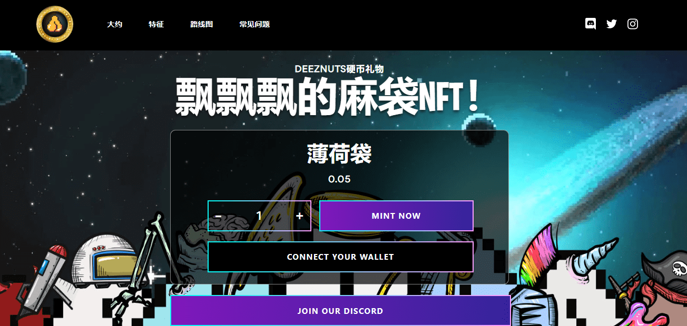

# Flappy Sack

**欢迎来到Flappy Sack Metaverse NFT！**

Flappy Sack Metaverse NFT是10，000个NFT的私人收藏品 - 独特的数字收藏品。每个Flappy Sack都作为ERC-721令牌存储在以太坊区块链上，并托管在IPFS上。2021年11月29日放弃。

每个NFT都具有100多种手绘特征，是独一无二的，并附带一个独家成功投资者群体的会员资格。加入一个充满激情，积极增长的社区，在Flappy Sack Metaverse中拥有多种好处和实用程序。

对于那些获得Flappy Sack NFT的人，您将加入我们的独家钻石坚果俱乐部。在这里，您将有机会进行交流，讨论和协作，以成为更大的坚果持有者，并加入加入OG团队的独家活动。

