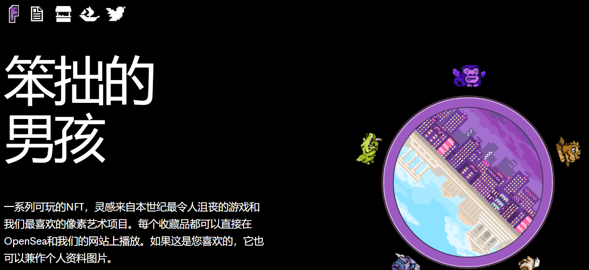

# Flappy Frames

Dream Protocols提供的888供应PFP集合。

在GENESIS铸造后不久，Dream Protocols背后的团队看到持有者摇动他们的Flappy Boy游戏角色作为个人资料图片。在团队艺术家近藤的激励下，我们同意以PPP的身份创造更好的表现形式，因此Flappy Frames诞生了。

一系列可玩的NFT，灵感来自本世纪最令人沮丧的游戏和我们最喜欢的像素艺术项目。每个收藏品都可以直接在OpenSea和我们的网站上播放。如果这是您喜欢的，它也可以兼作个人资料图片。

