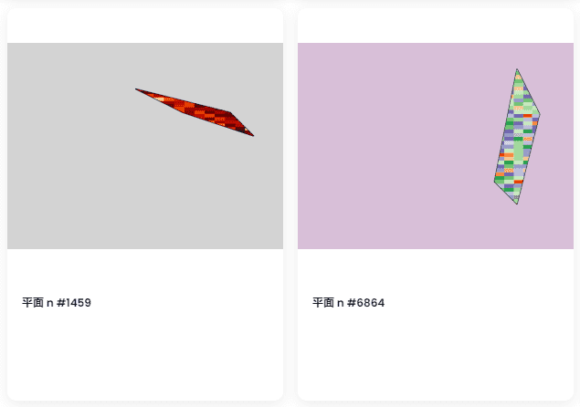

# Flat-n

**▶ 什么是 Flat-n？**
Flat-n 是一个 NFT（不可替代令牌）集合。存储在区块链上的数字艺术品的集合。

**▶ 存在多少个 Flat-n 令牌？**
总共有1，027个Flat-n NFT.目前有574个所有者在他们的钱包中至少有一个Flat-n NTF。

**▶ 最近卖了多少个Flat-n？**
在过去 30 天内售出了 0 个 Flat-n NFT。

