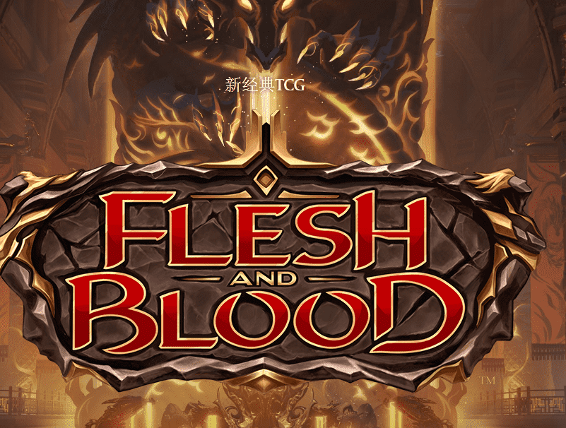

# Flesh And Blood V2

Flesh and Blood的第一套名为“Welcome to Rathe”于 2019 年 10 月发行，共有 226 张卡片。快进到现在，TCG 希望对游戏进行全新的尝试，他们称之为“FAB 2.0”。 
血肉之躯 2.0 是对游戏进行的有意识的更新集合，以：
更好地支持其前面提到的任务的交付
更好地支持作为社区中心的本地游戏商店，人们聚集在一起玩 FAB
将触角扩大到新的非英语市场，这将有助于实现其成为“真正的全球游戏”的目标
更好地致力于竞技比赛
Legend Story Studios 巩固的一件事是，FAB 2.0 并不是要改变游戏系统。现有的综合规则将不会有任何改动。

