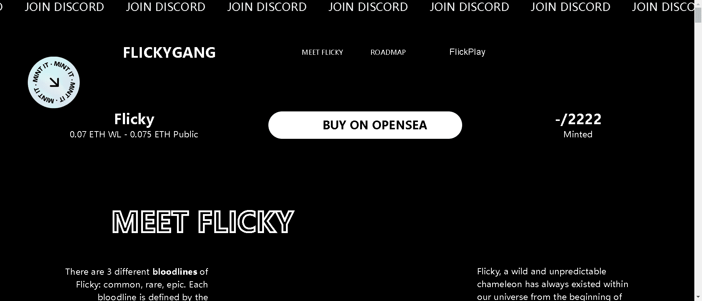

# FLICKYGANG BY FLICKPLAY

有3种不同血统

Flicky 的：常见的、稀有的、史诗般的。每个血统都是由 Flicky 的特征组合定义的，这些特征是基于一个点系统建立的。

2,222个独特的 Flicky，由手工创建的特征组成，包括面部表情、面部配饰和氛围。
根据其特征组合，每个 Flicky 都属于 3 种不同血统之一。每个特征都有一个从 1000 到 5000 的数字，与效用相关的特征获得额外积分。

