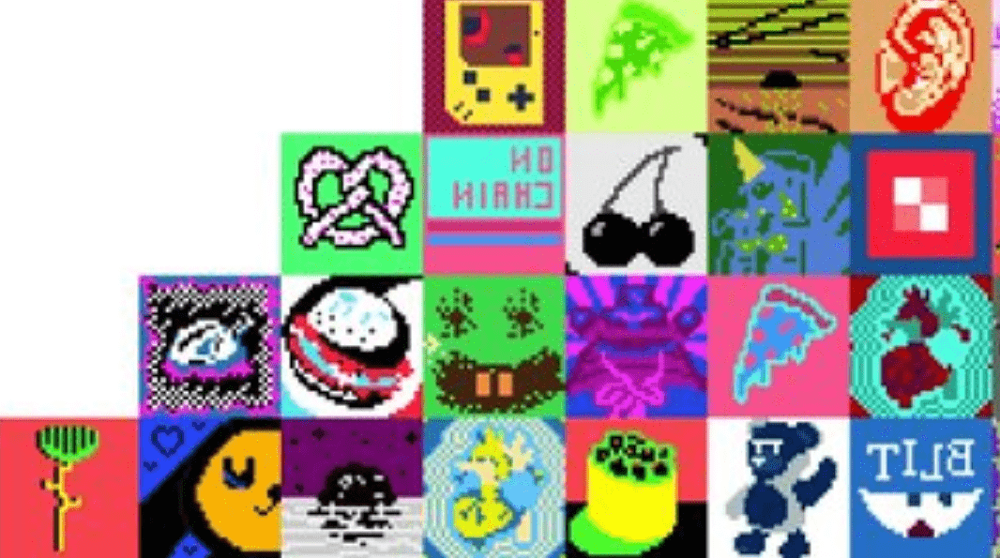

# Flipmap

我们重新发现了丢失的 8,300 个并将它们作为 Flipmaps 提供。Flipmap是根据CC0条款创建的衍生项目。我们不隶属于官方的 Blitmap 集合（但我们确实喜欢它们！）。什么是翻转图？
这是一个丢失的Blitmap，只是翻转了。得到它？
什么是丢失的 Blitmap？
最初的 Blitmap 集合有 10,000 种可能的组合，但只允许铸造 1,700 种。我们重新发现了丢失的 8,300 个，并将它们作为 Flipmap 提供。
我可以翻转原始 Blitmap 吗？
不可以。Flipmap 智能合约只允许“丢失”的 Blitmap 复活和翻转。原始 Blitmap 和同级可能无法翻转。
什么时候路线图？
六个月。只是在开玩笑; 很快。虽然这是一个受 Blitmap 启发的衍生项目，但我们完全在研究我们自己的一些原创想法。保持一致。
Flipmap 是否以与 Blitmap 相同的方式存储在链上？
是的！我们使用了 Blitmap 合约并添加了“翻转”，因此所有 Flipmap 数据都完全在链上。
为什么令牌 ID 从 1700 开始？
令牌 ID 从 1700 到 9999 运行，因为 Flipmap 是 Blitmap 集合的丢失兄弟，其最终令牌 ID 为 1699。

