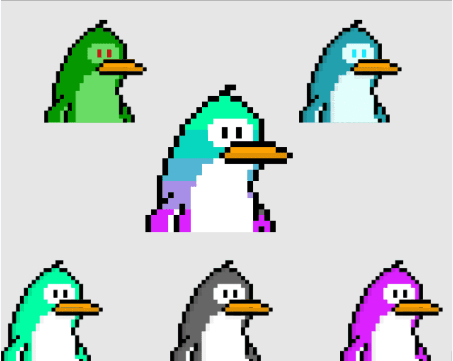

# FLIPPIESNFT V2

Flippies是一家人！
他们都是独一无二的，更喜欢住在社区里！属性越稀有，您的 Flippie 就越稀有。所有生成的 Flippies 都有一个从 #1 到 #10,000 的唯一 ID。每个人在任何 Flippie 上都有相同的机会。通过 Solanium 的首次 NFT 发布，分配将完全随机且公平！

超过 50 种独特的 Flippie 属性
每个 Flippie 都是独一无二的！社区中也有优质的 Flippies。Flippies 由 50 多种基于稀有度的属性生成，永远不会有相同的 Flippies。从帽子、眼镜、衣服、喉舌到名牌服装！属性越稀有，你的 Flippie 就越稀有！结合 Solanium 的彩票系统，我们的目标是成为有史以来最公平推出的 NFT 项目之一。
您已经可以在我们的网站上浏览所有可用的 Flippies，在分发完成之前您不知道会得到哪一个。

在白名单注册期和销售结束时，Solanium 将生成所有中奖地址的列表。我们将使用 Solana 区块链上未来插槽 97,105,000 的区块哈希来随机排序这个列表。
区块哈希将用作随机化的种子。接下来，所有 Flippies 将根据随机排序列表的顺序分配 1 到 10,000 个。

所有随机化和复制包将稍后在我们的 Github 上发布，因此任何人都可以验证分发是否公平执行。

