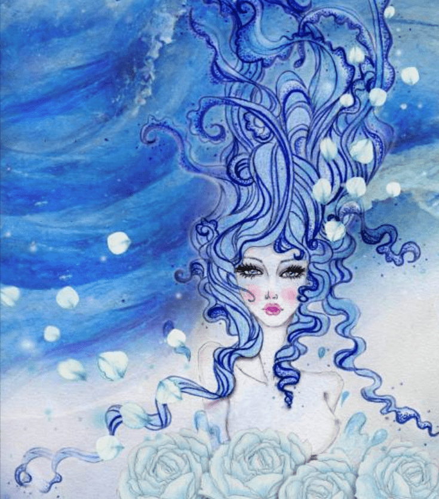

# FloLady Ochie

欢迎来到我的基金会收藏，介绍我的画作，原始角色，称为女继承人。

每个继承人都从她们的花朵中获得不同的权力。原创人物。铅笔画和数字，2022。我在纸上进行手绘和着色以及照片处理和数字工作。我喜欢制作原创角色。多年来，我绘制了 500 多个原创角色。每个角色都有个性、故事和背景。我通常在纸上画铅笔素描，然后用彩色铅笔着色。我扫描了作品并在 Photoshop 和 AI 上做了一些改进。

我的系列谈到了使用我的彩色铅笔手绘彩色原创人物赋予女性权力。我喜欢在我的画作中加入一些自然元素，比如花和动物。文化和女权主义也是我灵感的一部分。我喜欢颜色，包括黑色和白色，我会根据我正在制作的艺术品使用所有颜色。我也写诗，我通常将它们插入我的艺术描述中。我参加了 Stratosphere 2022 & Women of the World NYC 2022 展览。非常感谢您的时间和关注！

