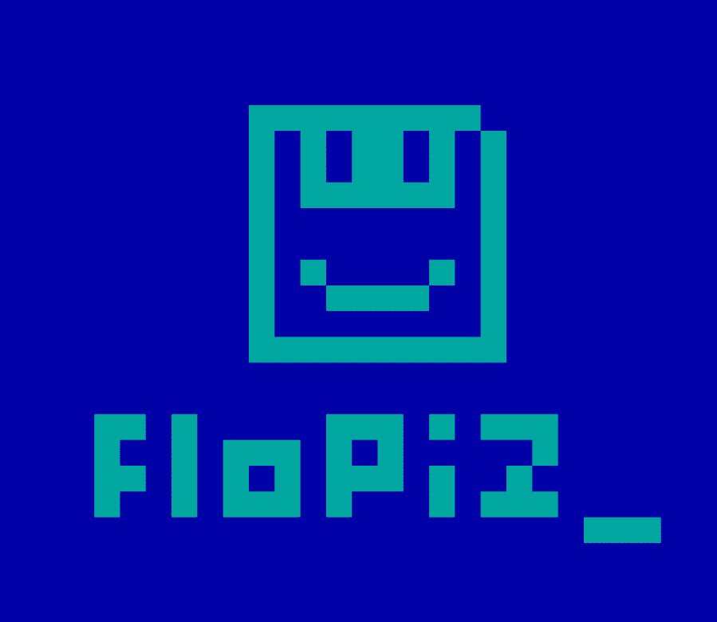

# Flopiz

看天空！这是一只鸟！不，是飞机！不，是拉里船长！

lopiz NFT 系列是对我们曾经喜爱的旧软盘的致敬，现在通常被称为“保存图标”。每个 Flopiz 都是逐个像素和逐帧动画制作的。

负责运行 Flopiz 王国的中心化区块链。Ridley 正在自己维护整个架构。不断地从服务器机房的一个部分跑到另一部分，他运行时产生的电能直接被所有节点吸收。在 24x24 像素的画布上逐个像素地手工制作，并逐帧制作动画

